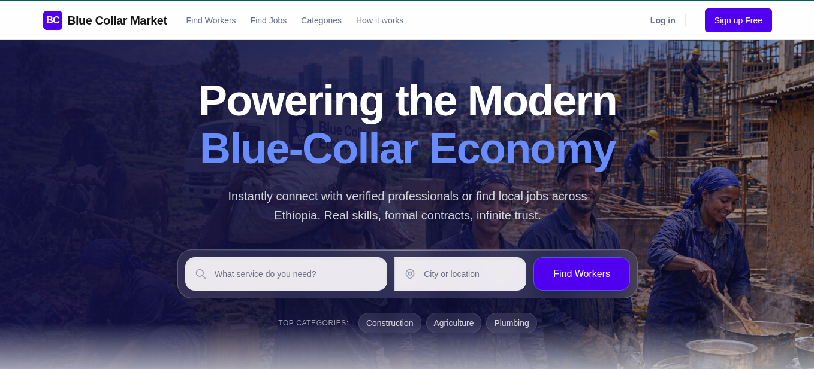
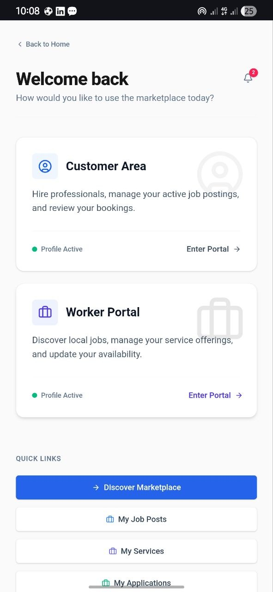
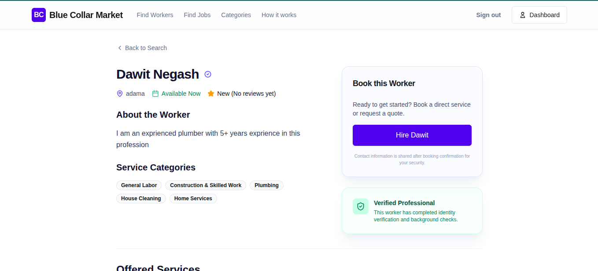
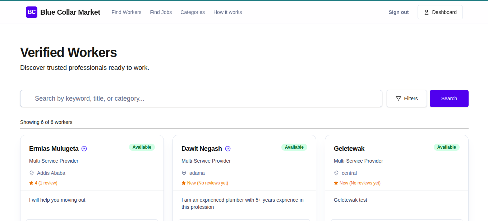
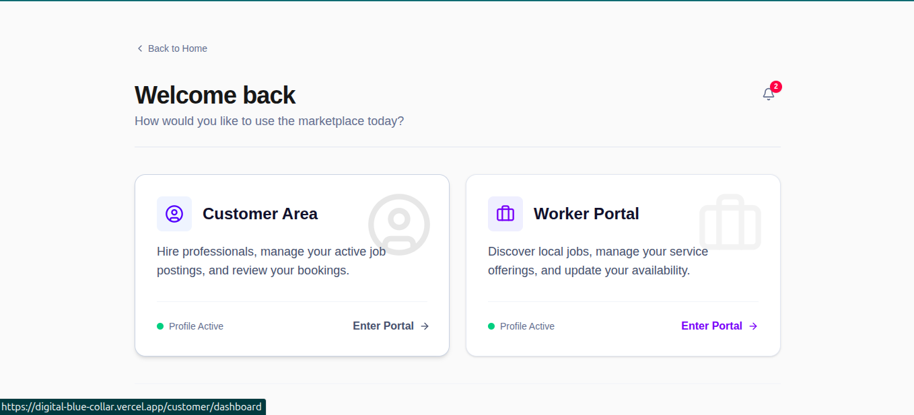
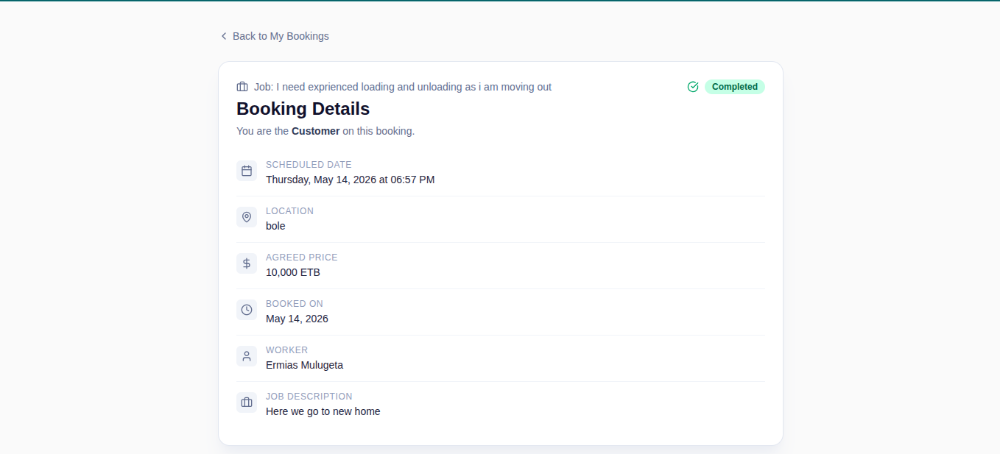
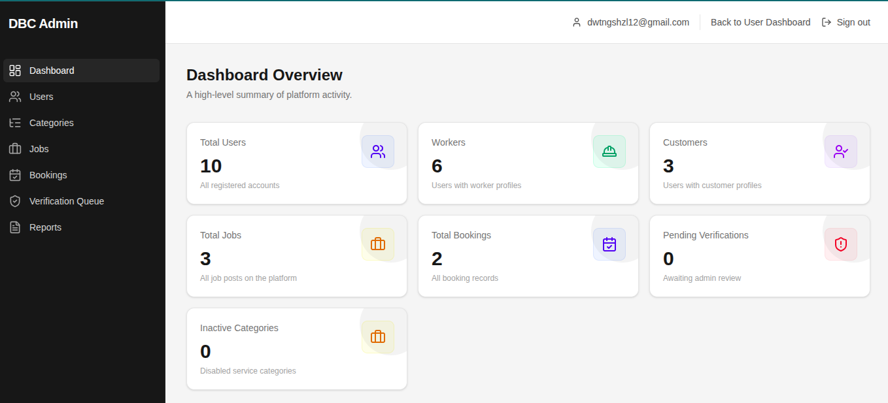

# 🔵 Digital Blue Collar — Ethiopian Services Marketplace

> A modern web platform connecting Ethiopian customers with trusted blue-collar workers across home services, agriculture, construction, transport, and general labor.

[](https://nextjs.org/)
[](https://react.dev/)
[](https://supabase.com/)
[](https://tailwindcss.com/)
[](https://www.typescriptlang.org/)

---

## Table of Contents

- [Project Overview](#project-overview)
- [Project Objectives](#project-objectives)
- [User Roles](#user-roles)
- [Features](#features)
- [Pages and Routes](#pages-and-routes)
  - [Public Routes](#public-routes)
  - [Auth Routes](#auth-routes)
  - [Dashboard Routes (Protected)](#dashboard-routes-protected)
  - [Worker Portal Routes (Protected)](#worker-portal-routes-protected)
  - [Customer Portal Routes (Protected)](#customer-portal-routes-protected)
  - [Admin Routes (Protected)](#admin-routes-protected)
  - [System Routes](#system-routes)
- [Tech Stack](#tech-stack)
- [Project Structure](#project-structure)
- [Database Schema](#database-schema)
- [Service Categories](#service-categories)
- [Getting Started](#getting-started)
  - [Prerequisites](#prerequisites)
  - [Installation](#installation)
  - [Environment Variables](#environment-variables)
  - [Database Setup](#database-setup)
  - [Running Locally](#running-locally)
- [Architecture Decisions](#architecture-decisions)
- [Deployment](#deployment)
- [Roadmap](#roadmap)
- [Contributing](#contributing)
- [License](#license)

---

## Project Overview

**Digital Blue Collar** is a marketplace platform purpose-built for the Ethiopian labor economy. It bridges the gap between customers who need real-world services — plumbing, construction, house cleaning, injera baking, agricultural labor, transport — and the skilled workers who provide them.

### The Problem

In Ethiopia, hiring blue-collar workers typically relies on word-of-mouth, informal networks, and physical presence at known gathering points. This creates inefficiencies for both parties:

- **Customers** struggle to find trusted, verified workers with transparent pricing.
- **Workers** lack a professional platform to showcase their skills and reach more customers.

### The Solution

Digital Blue Collar provides a structured digital marketplace where:

- Workers create professional profiles, list services with pricing, and get verified.
- Customers browse workers, post jobs, book services directly, and leave reviews.
- An admin team moderates the platform, manages categories, and handles verification.
- Trust is built through identity verification, reviews, and gated contact sharing (contact info is only revealed after booking acceptance).



---

## Project Objectives

| Objective                        | Description                                                                                         |
| -------------------------------- | --------------------------------------------------------------------------------------------------- |
| **Customer Discovery**           | Help customers find trusted local workers by category, location, and availability                   |
| **Worker Professionalism**       | Give workers a digital presence with profiles, services, pricing, and verification badges           |
| **Ethiopia-Specific Categories** | Support culturally relevant service categories (injera baking, plowing, daily labor, etc.)          |
| **Direct Booking & Job Posting** | Enable both direct service booking and open job posting with applications                           |
| **Trust & Safety**               | Build trust through ID verification, reviews, post-booking contact sharing, and admin moderation    |
| **Mobile-First & Lightweight**   | Ensure the platform works well on mobile devices with minimal data usage                            |
| **Admin Oversight**              | Provide platform administrators with tools for user management, moderation, and verification review |



---

## User Roles

### Guest / Public User

- Can browse the landing page, worker listings, job posts, categories, and informational pages
- Cannot book, post jobs, or access dashboards
- Can sign up or log in

### Customer

- Has a `customer_profile` with location, contact phone, and address
- Can post jobs, book workers directly, manage bookings, and leave reviews
- Accesses features through the unified `/dashboard` and `/customer/dashboard`

### Worker

- Has a `worker_profile` with bio, availability status, location, and contact details
- Can list services with pricing, apply to jobs, manage bookings, and request verification
- Accesses features through the unified `/dashboard` and `/worker/dashboard`



### Dual-Role User

- A single authenticated user can hold **both** a customer profile and a worker profile simultaneously
- The unified `/dashboard` page presents both portal cards, showing profile status for each role

### Admin

- Identified by the `is_admin` flag on the `users` table (protected by a database trigger)
- Accesses the `/admin` dashboard with overview stats, user management, category management, job/booking oversight, and verification queue
- Can ban/unban users, suspend/unsuspend jobs, toggle categories, and review verification requests
- Uses the Supabase service role key to bypass RLS for administrative queries

---

## Features

### Public Features

| Feature         | Status         | Description                                                                                          |
| --------------- | -------------- | ---------------------------------------------------------------------------------------------------- |
| Landing Page    | ✅ Implemented | Hero with search widget, trust metrics, how-it-works section, CTA                                    |
| Worker Listing  | ✅ Implemented | Public searchable/filterable list of workers with category, location, and availability filters       |
| Worker Profile  | ✅ Implemented | Detailed public profile showing bio, categories, services, pricing, verification badge, and book CTA |
| Job Listing     | ✅ Implemented | Public browsable list of open job posts                                                              |
| Job Detail      | ✅ Implemented | Individual job post detail page                                                                      |
| Categories Page | ✅ Implemented | Browsable category list with parent/child hierarchy                                                  |
| About Page      | ✅ Implemented | Static informational page                                                                            |
| How It Works    | ✅ Implemented | Step-by-step explanation of the platform                                                             |
| FAQ Page        | ✅ Implemented | Frequently asked questions                                                                           |
| Contact Page    | ✅ Implemented | Contact information                                                                                  |
| Banned Page     | ✅ Implemented | Landing page shown to banned users                                                                   |



### Authentication

| Feature               | Status         | Description                                        |
| --------------------- | -------------- | -------------------------------------------------- |
| Email/Password Signup | ✅ Implemented | Supabase Auth with email confirmation              |
| Login                 | ✅ Implemented | Email/password login with redirect support         |
| Forgot Password       | ✅ Implemented | PKCE-based password recovery email flow            |
| Update Password       | ✅ Implemented | Secure password update page for recovery flow      |
| Auth Callback         | ✅ Implemented | Handles Supabase auth redirects and token exchange |
| Session Middleware    | ✅ Implemented | Refreshes sessions, protects routes, enforces bans |

### Dashboard & Profile

| Feature                     | Status         | Description                                                                            |
| --------------------------- | -------------- | -------------------------------------------------------------------------------------- |
| Unified Dashboard           | ✅ Implemented | Role-aware hub showing Customer and Worker portal cards with profile status indicators |
| Worker Profile Management   | ✅ Implemented | Full form: name, bio, phone, address, location, availability status                    |
| Customer Profile Management | ✅ Implemented | Form: name, phone, address, location                                                   |
| Worker Onboarding           | ✅ Implemented | Guided onboarding flow at `/onboarding/worker`                                         |
| Worker Category Selection   | ✅ Implemented | Checkbox-card form for selecting service categories                                    |
| Profile Tab Switcher        | ✅ Implemented | Component for switching between profile sections                                       |



### Services & Jobs

| Feature                | Status         | Description                                                                                                |
| ---------------------- | -------------- | ---------------------------------------------------------------------------------------------------------- |
| Worker Services CRUD   | ✅ Implemented | Workers can create, edit, and manage service listings with category, price, negotiability, and description |
| Job Posting            | ✅ Implemented | Customers can create job posts with title, description, category, location, and budget                     |
| Job Applications       | ✅ Implemented | Workers can apply to jobs with proposed price and message                                                  |
| Application Management | ✅ Implemented | Dashboard page for viewing application status                                                              |
| Discover/Search        | ✅ Implemented | Authenticated search and discovery page                                                                    |

### Bookings

| Feature                      | Status         | Description                                                                           |
| ---------------------------- | -------------- | ------------------------------------------------------------------------------------- |
| Direct Booking               | ✅ Implemented | Customers can book workers directly from their profile with date, location, and price |
| Booking List                 | ✅ Implemented | Dashboard page showing all bookings for the user (as customer or worker)              |
| Booking Detail View          | ✅ Implemented | Detailed booking page with status, schedule, price, and action buttons                |
| Status Transitions           | ✅ Implemented | Role-aware state machine: pending → accepted → in_progress → completed (or cancelled) |
| Post-Booking Contact Sharing | ✅ Implemented | Contact info (phone, address, notes) revealed only after booking is accepted          |
| Booking Notifications        | ✅ Implemented | Automatic notifications on booking creation and status changes                        |



### Reviews

| Feature               | Status         | Description                                                                |
| --------------------- | -------------- | -------------------------------------------------------------------------- |
| Review Submission     | ✅ Implemented | Customers can submit star rating (1–5) and comment for completed bookings  |
| Review Display        | ✅ Implemented | Review cards with star rating component                                    |
| Worker Rating Summary | ✅ Implemented | Database function `get_worker_rating_summary` for average rating and count |

### Verification

| Feature                   | Status         | Description                                                                            |
| ------------------------- | -------------- | -------------------------------------------------------------------------------------- |
| Document Upload           | ✅ Implemented | Workers upload ID document and optional selfie to Supabase Storage                     |
| Verification Request      | ✅ Implemented | Creates a `verification_requests` record with pending status                           |
| Verification Status Alert | ✅ Implemented | Dashboard component showing current verification status                                |
| Verified Badge            | ✅ Implemented | Shield badge displayed on verified worker profiles                                     |
| Admin Review Queue        | ✅ Implemented | Admins can approve or reject with notes; status syncs to `worker_profiles` via trigger |

### Notifications

| Feature            | Status         | Description                                                          |
| ------------------ | -------------- | -------------------------------------------------------------------- |
| Notification Bell  | ✅ Implemented | Header bell icon with unread count                                   |
| Notification List  | ✅ Implemented | Dashboard page listing all notifications                             |
| Notification Items | ✅ Implemented | Individual notification with type, action URL, and read/unread state |
| Auto-Notifications | ✅ Implemented | Triggered on booking events                                          |

### Admin

| Feature             | Status         | Description                                                                                                     |
| ------------------- | -------------- | --------------------------------------------------------------------------------------------------------------- |
| Admin Dashboard     | ✅ Implemented | Overview with stat cards: users, workers, customers, jobs, bookings, pending verifications, inactive categories |
| User Management     | ✅ Implemented | List all users with profile indicators; ban/unban with duration and reason                                      |
| Category Management | ✅ Implemented | View all categories (including inactive); toggle active/inactive                                                |
| Job Oversight       | ✅ Implemented | View all jobs; suspend/unsuspend with reason                                                                    |
| Booking Oversight   | ✅ Implemented | View all bookings across the platform                                                                           |
| Verification Queue  | ✅ Implemented | Review pending verifications with signed document URLs; approve/reject                                          |
| Reports             | 🔲 Planned     | Reports page exists as placeholder                                                                              |
| Admin Guard         | ✅ Implemented | `requireAdmin()` server-side guard + `is_admin` column protected by DB trigger                                  |
| Service Role Bypass | ✅ Implemented | Admin queries use `createServiceRoleClient()` to bypass RLS                                                     |



### Design & UX

| Feature              | Status         | Description                                                                                                    |
| -------------------- | -------------- | -------------------------------------------------------------------------------------------------------------- |
| Custom Design System | ✅ Implemented | Semantic color tokens (primary, success, error, warning, muted) via Tailwind v4 `@theme`                       |
| UI Component Library | ✅ Implemented | Button, Card, Badge, Input, Select, Textarea, Label, Modal, Toast, Spinner, Skeleton, EmptyState, CheckboxCard |
| Responsive Layout    | ✅ Implemented | Mobile-first responsive design throughout                                                                      |
| Public Header        | ✅ Implemented | Sticky header with nav, auth-aware actions, and mobile drawer                                                  |
| Public Footer        | ✅ Implemented | Footer with links and branding                                                                                 |
| Design Preview Page  | ✅ Implemented | Internal design system preview at `/design`                                                                    |
| Glassmorphism Search | ✅ Implemented | Hero section search with frosted glass effect                                                                  |
| Loading States       | ✅ Implemented | Skeleton loaders and spinners across pages                                                                     |
| Error Boundaries     | ✅ Implemented | Custom error pages at multiple route levels                                                                    |

### Planned / Future

| Feature                           | Status                                     |
| --------------------------------- | ------------------------------------------ |
| In-App Messaging                  | 🔲 Planned (placeholder in booking detail) |
| Digital Payments                  | 🔲 Planned (referenced in landing page)    |
| Push Notifications                | 🔲 Planned                                 |
| Worker Portfolio / Gallery        | 🔲 Planned                                 |
| Advanced Search (proximity-based) | 🔲 Planned                                 |
| Multi-language Support (Amharic)  | 🔲 Planned                                 |
| Analytics Dashboard               | 🔲 Planned                                 |

---

## Pages and Routes

### Public Routes

| Route           | Purpose                            | Status | Notes                                                   |
| --------------- | ---------------------------------- | ------ | ------------------------------------------------------- |
| `/`             | Landing / Home page                | ✅     | Hero, search, trust metrics, how-it-works, CTA          |
| `/workers`      | Worker listing with search/filters | ✅     | Category, location, availability filters                |
| `/workers/[id]` | Public worker profile              | ✅     | Bio, services, categories, book CTA, verification badge |
| `/jobs`         | Public job listings                | ✅     | Browse open job posts                                   |
| `/jobs/[id]`    | Job post detail                    | ✅     | Full job description and details                        |
| `/categories`   | Service categories listing         | ✅     | Parent/child category hierarchy                         |
| `/about`        | About page                         | ✅     | Static informational content                            |
| `/how-it-works` | How the platform works             | ✅     | Step-by-step guide                                      |
| `/faq`          | Frequently asked questions         | ✅     | Common questions and answers                            |
| `/contact`      | Contact information                | ✅     | Contact details                                         |
| `/design`       | Design system preview              | ✅     | Internal design token showcase                          |
| `/banned`       | Banned user landing                | ✅     | Shown to users with `is_banned = true`                  |

### Auth Routes

| Route              | Purpose                        | Status | Notes                                         |
| ------------------ | ------------------------------ | ------ | --------------------------------------------- |
| `/login`           | User login                     | ✅     | Email/password, redirect support via `?next=` |
| `/signup`          | User registration              | ✅     | Email/password with Supabase Auth             |
| `/forgot-password` | Password recovery request      | ✅     | Sends PKCE recovery email                     |
| `/update-password` | Set new password               | ✅     | Accessible during recovery flow               |
| `/auth/callback`   | Supabase auth callback handler | ✅     | Token exchange and redirect                   |

### Dashboard Routes (Protected)

| Route                      | Purpose               | Status | Notes                                             |
| -------------------------- | --------------------- | ------ | ------------------------------------------------- |
| `/dashboard`               | Unified dashboard hub | ✅     | Shows Customer + Worker portal cards, quick links |
| `/dashboard/discover`      | Search and discovery  | ✅     | Authenticated marketplace discovery               |
| `/dashboard/jobs`          | My job posts          | ✅     | CRUD for customer job posts                       |
| `/dashboard/jobs/new`      | Create new job post   | ✅     | Job posting form                                  |
| `/dashboard/jobs/[id]`     | Job post detail       | ✅     | View/manage individual job                        |
| `/dashboard/services`      | My services (worker)  | ✅     | CRUD for worker service listings                  |
| `/dashboard/services/new`  | Create new service    | ✅     | Service creation form                             |
| `/dashboard/services/[id]` | Service detail        | ✅     | View/manage individual service                    |
| `/dashboard/applications`  | My job applications   | ✅     | View application statuses                         |
| `/dashboard/bookings`      | My bookings           | ✅     | List all bookings (as customer or worker)         |
| `/dashboard/bookings/new`  | Create direct booking | ✅     | Direct booking form, accepts `?worker_id=`        |
| `/dashboard/bookings/[id]` | Booking detail        | ✅     | Full detail with status actions, contact gating   |
| `/dashboard/notifications` | Notifications         | ✅     | List all notifications                            |
| `/dashboard/profile`       | Profile management    | ✅     | View/edit profile                                 |
| `/dashboard/verification`  | Verification request  | ✅     | Upload documents, view status                     |

### Worker Portal Routes (Protected)

| Route                      | Purpose                   | Status | Notes                                            |
| -------------------------- | ------------------------- | ------ | ------------------------------------------------ |
| `/worker/dashboard`        | Worker-specific dashboard | ✅     | Profile summary, availability status, categories |
| `/worker/settings/profile` | Worker profile settings   | ✅     | Edit worker profile form                         |
| `/onboarding/worker`       | Worker onboarding         | ✅     | Guided first-time setup                          |

### Customer Portal Routes (Protected)

| Route                        | Purpose                     | Status | Notes                                      |
| ---------------------------- | --------------------------- | ------ | ------------------------------------------ |
| `/customer/dashboard`        | Customer-specific dashboard | ✅     | Profile overview, job/booking placeholders |
| `/customer/settings/profile` | Customer profile settings   | ✅     | Edit customer profile form                 |

### Admin Routes (Protected)

| Route                  | Purpose             | Status     | Notes                                                                |
| ---------------------- | ------------------- | ---------- | -------------------------------------------------------------------- |
| `/admin`               | Admin dashboard     | ✅         | Stat cards: users, workers, customers, jobs, bookings, verifications |
| `/admin/users`         | User management     | ✅         | List users; ban/unban actions                                        |
| `/admin/categories`    | Category management | ✅         | View all; toggle active/inactive                                     |
| `/admin/jobs`          | Job oversight       | ✅         | View all jobs; suspend/unsuspend                                     |
| `/admin/bookings`      | Booking oversight   | ✅         | View all booking records                                             |
| `/admin/verifications` | Verification queue  | ✅         | Review pending; approve/reject with notes                            |
| `/admin/reports`       | Reports             | 🔲 Planned | Placeholder page                                                     |

### System Routes

| Route         | Purpose               | Status |
| ------------- | --------------------- | ------ |
| `/api/health` | Health check endpoint | ✅     |

---

## Tech Stack

| Layer            | Technology                               | Version   |
| ---------------- | ---------------------------------------- | --------- |
| **Framework**    | Next.js (App Router)                     | 16.2.4    |
| **UI Library**   | React                                    | 19.2.4    |
| **Language**     | TypeScript                               | 5.x       |
| **Styling**      | Tailwind CSS                             | 4.x       |
| **Backend / DB** | Supabase (PostgreSQL, Auth, Storage)     | Latest    |
| **Auth**         | Supabase Auth (PKCE) via `@supabase/ssr` | 0.10.2    |
| **Forms**        | React Hook Form + Zod                    | 7.x / 4.x |
| **Icons**        | Lucide React                             | 1.8.0     |
| **Utilities**    | clsx, tailwind-merge                     | Latest    |
| **Linting**      | ESLint + eslint-config-next              | 9.x       |
| **Fonts**        | Geist Sans & Geist Mono (via next/font)  | —         |

---

## Project Structure

```
digital-blue-collar/
├── public/
│   └── images/                     # Static assets (hero-bg.png)
├── src/
│   ├── app/
│   │   ├── (public)/               # Public pages (home, workers, jobs, categories, about, etc.)
│   │   ├── (auth)/                 # Auth pages (login, signup, forgot-password, update-password)
│   │   ├── (protected)/            # Protected routes
│   │   │   ├── dashboard/          # Unified dashboard with all user features
│   │   │   ├── worker/             # Worker-specific portal & settings
│   │   │   └── customer/           # Customer-specific portal & settings
│   │   ├── (admin)/                # Admin dashboard and management pages
│   │   ├── api/                    # API routes (health check)
│   │   ├── auth/                   # Auth callback handler
│   │   ├── onboarding/             # Worker onboarding flow
│   │   ├── worker/                 # Worker server actions (legacy location)
│   │   └── customer/               # Customer server actions (legacy location)
│   ├── components/
│   │   ├── admin/                  # Admin-specific components (tables, actions, sidebar)
│   │   ├── auth/                   # Auth forms (login, signup, forgot/update password)
│   │   ├── bookings/               # Booking components (form, card, detail, status badge)
│   │   ├── customer/               # Customer profile form
│   │   ├── jobs/                   # Job post form
│   │   ├── layouts/                # Layout components (header, footer, container)
│   │   ├── notifications/          # Notification bell, list, items
│   │   ├── profile/                # Profile tab switcher
│   │   ├── reviews/                # Review card, form, star rating
│   │   ├── search/                 # Search filters, pagination, worker/job lists
│   │   ├── shared/                 # Shared components (category badge)
│   │   ├── ui/                     # Base UI primitives (button, card, input, modal, toast, etc.)
│   │   ├── verification/           # Verification form and status alert
│   │   └── worker/                 # Worker forms (profile, services, categories, onboarding)
│   ├── lib/
│   │   ├── auth/                   # Auth utilities
│   │   ├── constants/              # App constants (notification types)
│   │   ├── db/                     # Database utilities
│   │   ├── services/               # Server-side service layer (admin, bookings, jobs, reviews, search, etc.)
│   │   ├── supabase/               # Supabase client helpers (server, client, middleware, service role)
│   │   ├── utils/                  # General utilities
│   │   ├── validations/            # Zod validation schemas
│   │   └── env.ts                  # Environment variable validation
│   ├── server/                     # Server actions (notifications)
│   ├── hooks/                      # Custom React hooks
│   ├── types/                      # TypeScript type definitions
│   └── middleware.ts               # Next.js middleware (session refresh, route protection, ban enforcement)
├── supabase/
│   ├── config.toml                 # Supabase local config
│   ├── migrations/                 # 16 SQL migration files
│   ├── seed.sql                    # Category and mock data seeding
│   └── seed_auth_users.sql         # Auth user seeding for development
├── docs/
│   ├── architecture/               # Architecture documentation
│   ├── decisions/                  # Decision records and tasks
│   └── product/                    # Product documentation
├── specs/                          # Feature specifications (18 spec directories)
└── package.json
```

---

## Database Schema

The application uses **Supabase (PostgreSQL)** with **Row Level Security (RLS)** enabled on all tables. The schema is managed through 16 sequential migration files.

### Core Tables

| Table                   | Purpose                                                                                            |
| ----------------------- | -------------------------------------------------------------------------------------------------- |
| `users`                 | Public proxy for `auth.users`; stores email, `is_admin`, `is_banned`, `banned_until`, `ban_reason` |
| `worker_profiles`       | Worker identity: bio, name, phone, address, location, availability, verification status            |
| `customer_profiles`     | Customer identity: name, phone, address, location                                                  |
| `service_categories`    | Hierarchical service taxonomy with parent/child and active toggle                                  |
| `worker_categories`     | Many-to-many: which categories a worker serves                                                     |
| `worker_services`       | Individual service offerings with price, negotiability, description                                |
| `job_posts`             | Customer job postings with category, location, budget, status, suspension fields                   |
| `job_applications`      | Worker applications to jobs with proposed price and message                                        |
| `bookings`              | Direct service bookings linking customer, worker, service/job, schedule, price, status             |
| `reviews`               | Post-booking reviews with 1–5 rating and comment (one per booking)                                 |
| `verification_requests` | Worker ID verification: document URL, selfie URL, admin notes, status                              |
| `notifications`         | In-app notifications with type, action URL, read state                                             |

### Enums

- `availability_status`: available, busy, offline
- `application_status`: pending, accepted, rejected, withdrawn
- `booking_status`: pending, accepted, in_progress, completed, cancelled
- `job_status`: open, in_progress, closed, cancelled
- `verification_status`: unverified, pending, verified, rejected

### Key Database Features

- **RLS Policies**: Owner-scoped mutations, public reads for worker/job/category data
- **Triggers**: `moddatetime` for auto-updating `updated_at`; user sync trigger; verification status sync trigger; admin flag protection trigger
- **Functions**: `get_worker_rating_summary()` for aggregated worker ratings
- **Storage**: `verification_documents` bucket with per-user RLS (5MB limit, image/PDF)
- **Indexes**: Optimized for search, lookup, and notification queries

---

## Service Categories

Ethiopia-specific service taxonomy seeded by default:

| Parent Category                 | Subcategories                                                             |
| ------------------------------- | ------------------------------------------------------------------------- |
| **Home Services**               | Laundry (Hand Washing), House Cleaning, Injera Baking, Cooking Assistance |
| **Agriculture**                 | Plowing, Planting, Weeding, Harvesting, Animal Care                       |
| **Construction & Skilled Work** | Masonry, Carpentry, Painting, Welding, Electrical Work, Plumbing          |
| **Transport & Logistics**       | Driver for Hire, Goods Transport, Delivery Assistance                     |
| **General Labor**               | Loading & Unloading, Daily Labor Work, Moving Assistance                  |

---

## Getting Started

### Prerequisites

- **Node.js** 18+ and **npm**
- A **Supabase** project (cloud or local via `supabase start`)

### Installation

```bash
git clone https://github.com/Deva021/digital_blue_collar.git
cd digital-blue-collar
npm install
```

### Environment Variables

Create a `.env` file in the project root:

```env
# Supabase (Required)
NEXT_PUBLIC_SUPABASE_URL=https://your-project.supabase.co
NEXT_PUBLIC_SUPABASE_ANON_KEY=your-anon-key

# Server-side (Required for admin operations)
SUPABASE_SERVICE_ROLE_KEY=your-service-role-key

# Database (Optional)
DATABASE_URL=postgresql://...
DIRECT_URL=postgresql://...
```

Environment variables are validated at build time via Zod in `src/lib/env.ts`.

### Database Setup

1. **Apply migrations** — Run all 16 migration files in `supabase/migrations/` against your Supabase project in chronological order.

2. **Seed data** — Run `supabase/seed.sql` to populate service categories and mock development data.

3. **Create an admin** — Manually set `is_admin = true` on a user record using the Supabase dashboard or SQL editor (the column is protected by a trigger and cannot be set via the API).

### Running Locally

```bash
npm run dev
```

Open [http://localhost:3000](http://localhost:3000) to view the application.

### Other Commands

```bash
npm run build          # Production build
npm run start          # Start production server
npm run lint           # Run ESLint
```

---

## Architecture Decisions

| Decision                        | Rationale                                                                                            |
| ------------------------------- | ---------------------------------------------------------------------------------------------------- |
| **Next.js App Router**          | Server Components for data fetching, Server Actions for mutations, route groups for layout isolation |
| **Supabase**                    | Managed PostgreSQL with built-in Auth, Storage, and RLS — no custom backend needed                   |
| **Route Groups**                | `(public)`, `(auth)`, `(protected)`, `(admin)` for layout and middleware separation                  |
| **Server Actions**              | All mutations use `"use server"` functions with Zod validation — no API route boilerplate            |
| **Service Role Client**         | Admin operations bypass RLS using the service role key for full table access                         |
| **Middleware Ban Enforcement**  | Global middleware checks `is_banned` on every request and redirects to `/banned`                     |
| **Post-Booking Contact Gating** | Contact details are only revealed in booking detail view when status is `accepted` or later          |
| **Unified Dashboard**           | Single `/dashboard` entry point for both roles, avoiding split portals                               |
| **Env Validation**              | Zod schema in `env.ts` validates all required env vars at startup                                    |
| **Tailwind v4 Theming**         | `@theme inline` block for semantic design tokens (primary, success, error, etc.)                     |

---

## Deployment

The application is designed for deployment on **Vercel** (recommended) or any platform supporting Next.js 16:

1. Connect your repository to Vercel
2. Set all environment variables in the Vercel dashboard
3. Ensure your Supabase project has the correct redirect URLs configured for authentication callbacks
4. Deploy

Production considerations:

- Set `NEXT_PUBLIC_SUPABASE_URL` and auth redirect URLs to your production domain
- Configure Supabase email templates with production URLs
- Server Actions body size is configured to 5MB for verification document uploads

---

## Roadmap

| Priority  | Feature                                                           | Status     |
| --------- | ----------------------------------------------------------------- | ---------- |
| 🔴 High   | Payment integration via Chapa (see details below)                 | 🔲 Planned |
| 🔴 High   | Multi-language support — Amharic & Afan Oromo (see details below) | 🔲 Planned |
| 🔴 High   | In-app messaging between customer and worker                      | 🔲 Planned |
| 🟡 Medium | Push notifications (web + mobile)                                 | 🔲 Planned |
| 🟡 Medium | Worker portfolio / photo gallery                                  | 🔲 Planned |
| 🟡 Medium | Proximity-based search with geolocation                           | 🔲 Planned |
| 🟡 Medium | Admin analytics and reports dashboard                             | 🔲 Planned |
| 🟢 Low    | PWA / mobile app wrapper                                          | 🔲 Planned |
| 🟢 Low    | Worker availability calendar                                      | 🔲 Planned |

### 💳 Payment Integration — Chapa Gateway

The platform will integrate [Chapa](https://chapa.co/), Ethiopia's leading payment gateway, to enable secure in-app payments in **Ethiopian Birr (ETB)**. Chapa aggregates multiple local payment methods under a single API, including:

- **Telebirr** (Ethio Telecom mobile money)
- **CBE Birr** (Commercial Bank of Ethiopia)
- **Amole** (Dashen Bank)
- **Bank transfers & debit cards**

#### Planned Payment Flow

1. Customer creates a booking with an agreed price
2. After the worker **accepts** the booking, a "Pay Now" button appears
3. The platform calls the Chapa Initialize API server-side to generate a secure checkout URL
4. Customer is redirected to Chapa's hosted checkout page to complete payment
5. On success, Chapa redirects back to the booking detail page
6. The platform verifies the payment server-side via the Chapa Verify API
7. Payment status is recorded and visible to both customer and worker
8. Contact information is shared after successful payment confirmation

#### Planned Schema Changes

- New `payments` table tracking: booking reference, amount, currency (`ETB`), Chapa transaction reference (`tx_ref`), status (`pending` → `success` / `failed`), payment method, and timestamps
- `payment_status` column added to `bookings` for quick lookup
- Row Level Security ensuring customers can only view their own payment records

#### Planned Technical Approach

| Component            | Details                                                                                                               |
| -------------------- | --------------------------------------------------------------------------------------------------------------------- |
| **API**              | Chapa REST API v1 — Initialize (`POST /v1/transaction/initialize`) and Verify (`GET /v1/transaction/verify/{tx_ref}`) |
| **Server-side only** | Chapa secret key stored as `CHAPA_SECRET_KEY` env var, never exposed to the client                                    |
| **Webhook**          | `/api/payments/callback` route to handle Chapa's post-payment callback                                                |
| **Admin**            | New admin payments page showing all transactions and revenue summary                                                  |
| **Testing**          | Chapa provides a sandbox (test mode) for development with test credentials                                            |

#### Future Payment Enhancements

- Worker payout support via Chapa Transfer API
- Split payments for platform commission
- Payment receipts and transaction history
- Refund handling

---

### 🌍 Multi-Language Support — Amharic (አማርኛ) & Afan Oromo

To serve Ethiopia's diverse population, the platform will add full internationalization (i18n) support for three languages:

| Language           | Code | Script        | Speakers                                                |
| ------------------ | ---- | ------------- | ------------------------------------------------------- |
| **English**        | `en` | Latin         | Default / international users                           |
| **Amharic** (አማርኛ) | `am` | Ge'ez (ፊደል)   | ~32M+ native speakers, official federal language        |
| **Afan Oromo**     | `om` | Latin (Qubee) | ~37M+ native speakers, largest ethnic group in Ethiopia |

#### Planned Approach

- **Framework**: [`next-intl`](https://next-intl-docs.vercel.app/) — the standard i18n library for Next.js App Router
- **Routing**: URL-based locale prefixes (`/am/workers`, `/om/jobs`). English as default locale with no prefix (`/workers`)
- **Translation files**: JSON message catalogs for each language (`src/messages/en.json`, `am.json`, `om.json`)
- **Language switcher**: UI component in the header allowing users to switch between **EN** | **አማ** | **OM**
- **Scope**: All user-facing strings — navigation, forms, buttons, status labels, error messages, landing page content, and dashboard UI

#### Planned Translation Scope (Phase 1)

| Area           | Details                                                                         |
| -------------- | ------------------------------------------------------------------------------- |
| Public pages   | Landing page, worker listing, job listing, categories, about, FAQ, how-it-works |
| Authentication | Login, signup, forgot password, update password forms                           |
| Navigation     | Header, footer, mobile drawer                                                   |
| Dashboard      | Unified dashboard, booking detail, notifications                                |
| Forms          | Profile forms, job posting, booking, review submission                          |

#### Planned Architecture Changes

- App directory restructured under a `[locale]` dynamic segment
- Middleware composed to handle both locale detection and Supabase auth
- `NextIntlClientProvider` wrapping the locale layout for client component translations
- All hardcoded strings extracted to translation keys

#### Accessibility Notes

- Amharic uses the Ge'ez script (ፊደል) which is **left-to-right** — no RTL layout changes needed
- Afan Oromo uses the Latin-based Qubee alphabet — fully compatible with existing typography
- Both scripts render well with the existing Geist font family, with system font fallbacks for Ge'ez characters

---

## Contributing

1. Fork the repository
2. Create a feature branch (`git checkout -b feature/your-feature`)
3. Commit your changes with clear messages
4. Push to your fork and open a pull request

Please review the feature specs in `specs/` for context on existing implementation patterns.

---

## License

This project is private and proprietary. All rights reserved.

---

<p align="center">
  <strong>Digital Blue Collar</strong> — Powering the Modern Blue-Collar Economy 🇪🇹
</p>
